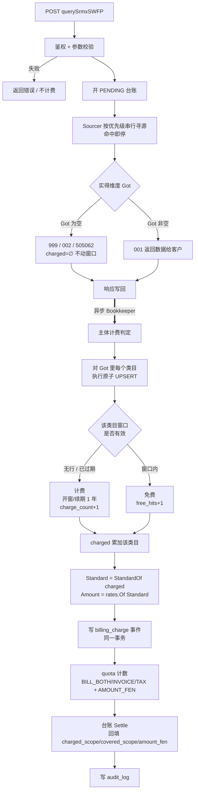
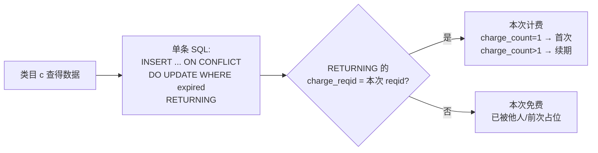

# 设计：主体年度计费（首次查得计费，同主体同类目一年内免费）

状态：**收入侧已实现并单测通过**（§11 列出实际落地清单与与本设计的偏差）。
成本侧（`upstream_coverage`）只建了表，逻辑待上游真实单价配好后接入——现在全部
`costFen` 都是 0，接了也算不出东西。

前置阅读：`docs/设计_多源计费与上游对账.md`（现行的「按实得维度定档」计费）。

阅读顺序建议：§1 是最重要的一节（说明为什么这次改动比预想的小得多）；§7 是第二重要的
（上游同为主体年度计费带来的连锁后果，含一个现存的成本核算错误）；§8 记录了全部已确认
的决策与明文存储的法律依据；§9 是实现清单。九条决策全部确认，无待定项。

---

## 1. 从现状出发：这次改动到底改了什么

先说清楚现行代码已经有什么，否则很容易把这次改动做成重复建设。

`DataHub_SWFP` 当前的计费已经是**按实际查得的维度定档**（`internal/domain/model/sourcing.go`）：

| 实得维度 `Got` | 收费标准 `FeeStandard` | 单价来源 |
| --- | --- | --- |
| 发票 + 税务 | `both` | `license.rate_both_fen`，缺则 `billing.rates.bothFen` |
| 仅发票 | `invoice` | `license.rate_invoice_fen` |
| 仅税务 | `tax` | `license.rate_tax_fen` |
| 皆无 | `none` | 恒 0 |

判定链路是 `Sourcer` 累积 `Got` → `billing.Decide` 取 `StandardOf(Got)` → `Settle` 把
`fee_standard/amount_fen` 落进 `billing_ledger` 与 `audit_log`。

新规则要加的是**另一个正交的轴**：同一客户、同一社会信用代码、同一类目，一年之内只收一次钱。

**关键结论：这两个轴可以直接相乘，不需要新的定价体系。**

```
本次应收类目  charged = Got − Covered        （实得的，减掉还在免费期的）
本次收费标准  Standard = StandardOf(charged)  ← 复用现有函数，不新增档位
本次应收金额  Amount   = rates.Of(Standard)   ← 复用现有三档合同价
```

`Covered` 就是新引入的唯一状态。定价逻辑、费率表、寻源引擎、契约层**一行都不用改**。
`model.DimSet` 上现成的 `Missing` 方法正好就是这个减法：`covered.Missing(got)`。

这也顺带满足了「用户只可见 发票计费 / 税务计费 / 税务发票计费」——三档标准正好就是
这三个对客口径，`charged` 落在哪档就计哪个计数器。

---

## 2. 规则的精确表述

计费主体 = `(license_id, creditCode, category)`，`category ∈ {invoice, tax}`。

1. 某主体**首次查得**该类目数据时计费一次，并开启一个 **1 年免费窗口**。
2. 窗口内该主体该类目再怎么查都不收钱（无论查了多少次、无论我们调了几个上游）。
3. 窗口按**日历年**从计费时刻起算，**免费查询不延长窗口**（窗口到期后的下一次查得
   重新计费并开新窗口）。
4. 两个类目的窗口**各自独立**：先只查税务的客户，后来查到发票数据时，发票单独计费。
5. **只有真的拿到数据才动窗口。** 查无（999）、部分源异常但无数据（002）、全部源失败
   （505062）一律不计费、不开窗口。
6. 计费与「成功查得数」`serviceUsed` 完全解耦：后者继续按 `busiCode 10` 累加，不受
   免费窗口影响（客户看到的调用量统计不变）。

### 2.1 判定表

`want` = 请求维度，`got` = 实得维度，`cov` = 命中免费期的类目。

| # | want | got | 免费期状态 | charged | 收费标准 | 窗口动作 |
| --- | --- | --- | --- | --- | --- | --- |
| 1 | both | 发票+税务 | 都没有 | 发票+税务 | `both` | 开两个窗口 |
| 2 | both | 发票+税务 | 两个都在 | ∅ | `none` | 两个窗口各 +1 次免费命中 |
| 3 | both | 发票+税务 | 只有税务在 | 发票 | `invoice` | 开发票窗口 |
| 4 | tax | 税务 | 无 | 税务 | `tax` | 开税务窗口 |
| 5 | both | 发票+税务 | 税务在（承 #4） | 发票 | `invoice` | 开发票窗口 ← **用户场景** |
| 6 | both | 仅发票（税务查无） | 无 | 发票 | `invoice` | 只开发票窗口 |
| 7 | both | 无（999） | — | ∅ | `none` | 不动 |
| 8 | both | 无（002 部分源异常） | — | ∅ | `none` | 不动 |
| 9 | any | — （全源失败） | — | ∅ | `none` | 不动，台账 PENDING |
| 10 | tax | 税务 | 税务窗口已过期 | 税务 | `tax` | 续期，`charge_count+1` |

注意 #5：客户分两次查，总共付 `taxFen + invoiceFen`，比一次查 both 的 `bothFen` 贵
（假设 `bothFen < invoiceFen + taxFen` 的常规打包价）。这是规则的自然结果，不是 bug，
但**费率配置时必须保证 `bothFen ≤ invoiceFen + taxFen`**，否则客户拆开查反而便宜，
出现套利。见 §8 决策 3（是否改为「升级补差价」）。

---

## 3. 流程图

### 3.1 主链路



**为什么判定放在响应之后（异步）**：下游响应体（`head`/`body`）里不含任何金额或计费
字段（见 `internal/api/handler.go` 与 `model.QueryBody`），所以计费结论对构造响应毫无
贡献。放进 `Bookkeeper` 可以让关键路径不增加任何 DB 往返——现行架构已经把结算和审计
移出关键路径了，主体计费顺着这条既有通道走即可。

### 3.2 单类目的判定（这是全部并发正确性的所在）



并发安全性来自 Postgres 的行级锁：两个并发请求同时打同一个不存在的主体时，先到者
INSERT，后到者在唯一索引上阻塞，解锁后走 `DO UPDATE` 分支并看到已生效的窗口 → 判为
免费。**恰好一次计费**，不需要应用层加锁、不需要分布式锁。

---

## 4. 数据库设计

收入侧新增两张表：一张**可变状态表**（当前窗口）+ 一张**追加写事件表**（计费流水）。
成本侧还有第三张 `upstream_coverage`，形状与状态表同构，见 §7.3。
状态表回答「现在还免不免费」，事件表回答「这一年里每一笔钱是怎么来的」——续期会覆盖
状态表，历史只能靠事件表留存。

### 4.1 `billing_coverage`：免费窗口状态（每主体每类目一行）

```sql
CREATE TABLE billing_coverage (
    license_id        VARCHAR(64)  NOT NULL,          -- 计费主体：用 license_id 而非 app_key
    route             VARCHAR(16)  NOT NULL DEFAULT 'swfp',
    credit_code       VARCHAR(32)  NOT NULL,          -- 统一社会信用代码（明文，已 ToUpper 规整）
    category          VARCHAR(8)   NOT NULL,          -- invoice | tax
    first_charged_at  TIMESTAMPTZ  NOT NULL DEFAULT now(), -- 历史首次计费，永不变（对客解释用）
    charged_at        TIMESTAMPTZ  NOT NULL DEFAULT now(), -- 本轮计费时刻 = 窗口起点
    expires_at        TIMESTAMPTZ  NOT NULL,               -- 免费期截止（不含），到点即可再计费
    charge_count      INT          NOT NULL DEFAULT 1,     -- 该主体该类目累计计费轮数
    free_hits         BIGINT       NOT NULL DEFAULT 0,     -- 本轮免费命中次数（成本敞口指标）
    last_hit_at       TIMESTAMPTZ,                         -- 最近一次查得（含免费）
    charge_reqid      VARCHAR(32)  NOT NULL DEFAULT '',    -- 本轮计费那次请求的 reqid
    charge_request_id VARCHAR(64)  NOT NULL DEFAULT '',
    updated_at        TIMESTAMPTZ  NOT NULL DEFAULT now(),
    PRIMARY KEY (license_id, route, credit_code, category)
);

-- 「列出我当前还在免费期的主体」（对客自查接口 + 后台）
CREATE INDEX idx_coverage_active ON billing_coverage (license_id, route, expires_at);
-- 跨客户按主体排查（后台）
CREATE INDEX idx_coverage_code   ON billing_coverage (credit_code);
```

设计取舍：

- **主键用 `license_id` 不用 `app_key`。** `app_key` 会因重建账号而变，一变则客户的
  全部免费期凭空消失（客户视角是重复收费）。`license_id` 是稳定的计费实体标识。
- **`credit_code` 存明文。** 统一社会信用代码是公开工商信息，不是个人 PII；审计日志
  里的 `id_card_mask` 脱敏是给操作日志看的，计费窗口必须能被精确查询与对客解释
  （「这家公司你 3 月 4 日查过，免到明年 3 月 4 日」）。若合规上要求不落明文，可改存
  `sha256(credit_code)` + 保留前 4 后 4 用于展示，但会牺牲后台的模糊检索能力。
- **`route` 进主键**，与既有 `quota (license_id, route, dim)` 的约定保持一致。当前只有
  `swfp` 一个路由，成本几乎为零，但省掉了未来再加路由时的迁移。
- **每次查得都写这张表**（免费命中也 UPDATE `free_hits`/`last_hit_at`）。多一次异步
  UPDATE，换来「这个主体被免费查了多少次」这个指标。它不再是成本敞口指标（上游同为
  主体年度计费，重复查询不花钱，见 §7），而是**客户实际使用强度**的度量：`free_hits`
  很高说明这个主体对客户很有价值，是续约谈判与定价调整的依据。

### 4.2 `billing_charge`：计费事件流水（追加写）

```sql
CREATE TABLE billing_charge (
    id                BIGSERIAL    PRIMARY KEY,
    license_id        VARCHAR(64)  NOT NULL,
    app_key           VARCHAR(64)  NOT NULL,          -- 冗余，便于不 join license 出账
    route             VARCHAR(16)  NOT NULL DEFAULT 'swfp',
    credit_code       VARCHAR(32)  NOT NULL,
    reqid             VARCHAR(32)  NOT NULL,          -- 与台账同构的幂等键
    request_id        VARCHAR(64)  NOT NULL,
    ledger_id         BIGINT,                         -- → billing_ledger.id
    charged_invoice   BOOLEAN      NOT NULL DEFAULT FALSE, -- 本次为发票类目收了钱
    charged_tax       BOOLEAN      NOT NULL DEFAULT FALSE, -- 本次为税务类目收了钱
    covered_invoice   BOOLEAN      NOT NULL DEFAULT FALSE, -- 本次发票命中免费期
    covered_tax       BOOLEAN      NOT NULL DEFAULT FALSE,
    fee_standard      VARCHAR(16)  NOT NULL,          -- both | invoice | tax
    amount_fen        BIGINT       NOT NULL DEFAULT 0,
    upstream_cost_fen BIGINT       NOT NULL DEFAULT 0, -- 本次上游总成本（含免费期内的支出）
    kind              VARCHAR(8)   NOT NULL,          -- first | renew | mixed
    window_to         TIMESTAMPTZ,                    -- 本次开启/续期的窗口截止（快照）
    created_at        TIMESTAMPTZ  NOT NULL DEFAULT now(),
    CONSTRAINT uq_charge UNIQUE (license_id, route, reqid)
);

CREATE INDEX idx_charge_license_time ON billing_charge (license_id, created_at);
CREATE INDEX idx_charge_code         ON billing_charge (credit_code);
```

设计取舍：

- **一次请求一行，不是一个类目一行。** `both` 档是一个打包价 `bothFen`，不是
  `invoiceFen + taxFen`，硬拆到两个类目行上会产生任意的分摊，对账时反而说不清。用两组
  布尔列表达「这一笔为哪些类目收了钱」，既能按类目统计（`count(*) where charged_invoice`）
  又不用编造分摊金额。
- **只写产生应收的请求。** 月度出账 = 扫这张表，不必在几百万行台账里过滤。不计费的
  请求在 `billing_ledger` 里照常有一行（含 `upstream_cost_fen`），亏损单不会消失。
- **`window_to` 是快照。** `billing_coverage` 会被续期覆盖，事件表必须自己留一份，否则
  一年后没法回答「当时开的窗口是到哪天」。
- 唯一键 `(license_id, route, reqid)` 保证重放/重试幂等（写入用 `ON CONFLICT DO NOTHING`）。

### 4.3 既有表的增列

```sql
-- billing_ledger：把「本次为什么收/没收钱」落在台账上，无需 join 就能解释一行
ALTER TABLE billing_ledger ADD COLUMN IF NOT EXISTS credit_code   VARCHAR(32) NOT NULL DEFAULT '';
ALTER TABLE billing_ledger ADD COLUMN IF NOT EXISTS charged_scope VARCHAR(16) NOT NULL DEFAULT ''; -- 本次真收钱的类目 invoice+tax/invoice/tax/none
ALTER TABLE billing_ledger ADD COLUMN IF NOT EXISTS covered_scope VARCHAR(16) NOT NULL DEFAULT ''; -- 本次命中免费期的类目
ALTER TABLE billing_ledger ADD COLUMN IF NOT EXISTS charge_state  VARCHAR(16) NOT NULL DEFAULT ''; -- CHARGED|FREE|NOCHARGE|DEFERRED

ALTER TABLE audit_log ADD COLUMN IF NOT EXISTS credit_code   VARCHAR(32) NOT NULL DEFAULT '';
ALTER TABLE audit_log ADD COLUMN IF NOT EXISTS charged_scope VARCHAR(16) NOT NULL DEFAULT '';
ALTER TABLE audit_log ADD COLUMN IF NOT EXISTS covered_scope VARCHAR(16) NOT NULL DEFAULT '';
ALTER TABLE audit_log ADD COLUMN IF NOT EXISTS charge_state  VARCHAR(16) NOT NULL DEFAULT '';

-- 可选：合同约定的免费期长度（Postgres interval，空则取全局配置）
ALTER TABLE license ADD COLUMN IF NOT EXISTS free_window INTERVAL;
```

`charge_state` 就是你要的**新计费标识**，四态含义：

| 值 | 含义 |
| --- | --- |
| `CHARGED` | 本次产生应收（`charged_scope ≠ none`） |
| `FREE` | 查得了数据，但全部类目都在免费期内 → 不收钱 |
| `NOCHARGE` | 没查得数据（999/002/失败）→ 无从计费 |
| `DEFERRED` | 计费判定本身失败（DB 异常）→ 本次按 0 收，留待对账补记，见 §6 |

**`audit_log.billed` 的语义要改。** 它现在等于 `decision.Returned`，跟同一张表的
`found_data` 完全重复（都来自 `busiCode 10`）。新口径下它应当表示「本次是否真的收了钱」
= `charge_state = 'CHARGED'`。`found_data` 保持「是否查得数据」不变——这正是你要的
「计费与查得统计彻底分开」：同一行里 `found_data=true, billed=false` 就是一次免费命中。

### 4.4 计数器：零迁移

`quota` 表是 `(license_id, route, dim)` 三元主键 + 通用 `addCount` UPSERT
（`postgres/store.go`），加维度**不需要任何 DDL**。新增四个 `dim`：

| dim | 含义 | 对客展示名 |
| --- | --- | --- |
| `SERVICE` | 累计成功查得数（**不变**） | 成功查得数 |
| `CALL` | 累计调用上游次数（**不变**） | 调用次数 |
| `BILL_BOTH` | 按 `both` 档计费的笔数 | 税务发票计费 |
| `BILL_INVOICE` | 按 `invoice` 档计费的笔数 | 发票计费 |
| `BILL_TAX` | 按 `tax` 档计费的笔数 | 税务计费 |
| `AMOUNT_FEN` | 累计应收金额（分） | 累计费用 |

Redis 侧沿用现有 `quota:{lid}:{route}:{key}` + write-through PG 镜像的管线，只是多几个
key。「发票类目累计计费数」= `BILL_BOTH + BILL_INVOICE`，可推导，不必单独存。

---

## 5. 那条原子 SQL

单类目判定与开窗合并成一条语句，这是整个设计的地基：

```sql
INSERT INTO billing_coverage AS c
    (license_id, route, credit_code, category,
     first_charged_at, charged_at, expires_at,
     charge_count, free_hits, last_hit_at, charge_reqid, charge_request_id)
VALUES ($1, $2, $3, $4,
        now(), now(), now() + $5::interval,
        1, 0, now(), $6, $7)
ON CONFLICT (license_id, route, credit_code, category) DO UPDATE SET
    charged_at        = CASE WHEN c.expires_at <= now() THEN now()                ELSE c.charged_at        END,
    expires_at        = CASE WHEN c.expires_at <= now() THEN now() + $5::interval ELSE c.expires_at        END,
    charge_count      = c.charge_count + CASE WHEN c.expires_at <= now() THEN 1 ELSE 0 END,
    free_hits         = c.free_hits    + CASE WHEN c.expires_at <= now() THEN 0 ELSE 1 END,
    charge_reqid      = CASE WHEN c.expires_at <= now() THEN $6 ELSE c.charge_reqid      END,
    charge_request_id = CASE WHEN c.expires_at <= now() THEN $7 ELSE c.charge_request_id END,
    last_hit_at       = now(),
    updated_at        = now()
RETURNING (charge_reqid = $6) AS charged,        -- 本次是否计费（开窗或续期）
          expires_at, charge_count;
```

为什么这样是对的：

- **计费判据用 `charge_reqid = $6`，不用时间比较、也不用 `xmax`。** reqid 每请求唯一，
  所以「这一行当前记录的计费请求就是我」当且仅当本次由我计费——无论是 INSERT 开窗还是
  到期续期，两条路径都把 `charge_reqid` 置为 `$6`，而免费命中路径保留旧值。这个判据不
  依赖 `RETURNING` 对新旧行值的解析规则（`ON CONFLICT DO UPDATE` 的 `SET` 子句里
  `c.col` 是旧值，而 `RETURNING` 给的是新行，这个区别很容易记反），也不依赖事务时间戳
  的稳定性。
- **`first_ever` 由 `charged && charge_count = 1` 推出**，不需要 `xmax` 系统列：
  `charge_count` 插入时即为 1、仅在续期时 +1，语义完全等价。
- 免费命中路径也走 `DO UPDATE`（只累加 `free_hits`），因此**一次查得 = 一条语句**，
  不需要先 SELECT 再判断（那样会有 TOCTOU 竞态）。
- `$5` 传 `'1 year'` 这种 **Postgres 日历 interval**，不要传 Go 的 `8760h`——闰年会差
  一天，客户会在 2 月 29 日附近发现被提前收费。

两个类目 + 一条 `billing_charge` 插入应放在**同一个事务**里，避免窗口开了但流水没落
（或反之）。事务范围仅这三条语句，都是主键定位，锁持有时间在微秒级。

---

## 6. 代码落点（现有核心逻辑不动）

| 文件 | 改动 | 量级 |
| --- | --- | --- |
| `migrations/0008_subject_billing.sql` | 新建 `billing_coverage` / `billing_charge` / `upstream_coverage` 三表 + 既有表增列（DDL 一次做完，避免二次迁移） | 新增 |
| `internal/domain/model/subject.go` | `Category`、`ChargeState`、`CoverageRequest`、`CategoryVerdict`、`CoverageResult` 等类型 | 新增 |
| `internal/domain/model/model.go` | `BillingDecision` 加 `Charged/Covered DimSet` + `ChargeState`；`Ledger`/`LedgerSettlement`/`AuditRecord` 加四个字段 | 增字段 |
| `internal/domain/billing/subject.go` | 纯函数 `Chargeable(got, covered)` + `ApplyCoverage` 由 verdict 重算 `Standard/AmountFen` | 新增 |
| `internal/domain/port/port.go` | 新增 `SubjectBillingRepository`；`QuotaRepository` 加计费计数器两方法 | +1 接口 |
| `persistence/postgres/subject_store.go` | 上面那条 SQL + `billing_charge` 插入 | 新增 |
| `persistence/memory/subject_store.go` | 内存实现（测试/`driver: memory`） | 新增 |
| `internal/application/orchestrator.go` | `bookTask` 多带 `creditCode` 与 `rates`；新增只读的 `CoverageQuery` | ~30 行 |
| `internal/application/bookkeeper.go` | `process` 在 `Settle` 之前插入主体计费判定，回填 `decision` 与 `rec` | ~20 行 |
| `internal/domain/quota/service.go` | `Settle` 按 `charged` 累加新 dim | ~10 行 |
| `redis/quota.go` + `postgres/store.go` | 新计数器读写；台账四列的读写 | 样板代码 |
| `postgres/admin_store.go` | `audit_log` 四列的写入与读取 | 样板代码 |
| `internal/api/handler.go` | `quotaSWFP` 扩 `billing` 子对象 + 新增 `coverageSWFP` | 新增 |
| `cmd/relay/{main,config}.go` | 装配 `subjectRepo`；新增 `billing.freeWindow` 配置 | ~15 行 |
| `internal/domain/parse/parse.go` | 抽出 `NormalizeCreditCode`，让查询与自查接口算出同一个计费键 | ~10 行 |

**完全不动**的部分：`upstream/sourcing.go`、`upstream/swfpcontract.go`、`upstream/entcredit.go`、
`upstream/salesdata.go`、`domain/parse`、`domain/auth`、`domain/mapping`、响应信封。
寻源与契约层对本次改动无感——这符合你「不改核心代码、只加逻辑和库表」的要求。

### 6.1 顺序与失败处理

`Bookkeeper.process` 内的次序必须是：**主体计费判定 → 重算 `decision.Standard/AmountFen`
→ `quota.Settle`（写台账）→ `AppendUpstreamCalls` → `AppendAudit`**。因为
`Settle` 与 `AppendAudit` 都要写金额，判定必须在它们之前完成。

判定失败（DB 不可用）时**fail-closed**：本次 `amount_fen = 0`、`charge_state = 'DEFERRED'`、
`err_msg` 记原因。宁可暂时少收，也绝不能因为一次 DB 抖动就给客户重复收费（fail-open 的
后果是客户对账时发现同一主体一年内被收了两次，这是最难解释的错误）。`DEFERRED` 的台账
由对账任务扫出来补记——它带着 `credit_code` 与 `reqid`，重放那条原子 SQL 是幂等的。

进程崩溃窗口与现有异步记账一致：PENDING 台账已在响应前同步落库，是崩溃安全锚点；队列里
未落库的计费判定会丢，由同一个对账任务兜底。

---

## 7. 成本侧必须对称：上游也是主体年度计费

**这是本次设计里最容易被漏掉、后果最贵的一条。**

上游（证通各产品码、销项数据）对我们采用的**也是「同主体同类目一年内只收一次」的口径**，
不是按调用次数收。这条事实目前只存在于商务合同里，仓库内**没有任何记录**（`config.example.yaml`
里五个源的 `costFen` 全是 0，成本核算还没真正启用）。建议把它写进本文与配置注释，
否则下一个接手的人一定会按「每次调用都花钱」去做成本核算。

### 7.1 它先消掉了一个我原本担心的风险

我起初担心：免费期内的重复查询收入为 0、成本照旧，会变成亏损机器。**这个担心不成立**，
因为上游同样不重复收费。免费期内的重复查询对我们既无收入也无成本，是干净的零。

所以：**不需要主体结果快照，不需要免费期限流，查询关键路径完全不动。**（快照仍可作为
纯性能优化在将来考虑，但不再有经济上的紧迫性。）

### 7.2 它反过来揭示了真正的业务模型

成本窗口的键**不含 `license_id`**——上游按主体收我们的钱，不管是我们哪个客户问的。
于是同一个主体年度里：

```
上游成本 = 1 次（我们整个机构付一次）
下游收入 = N 次（N = 查过这家企业的客户数，每人一次）
```

**毛利随客户重叠度增长。** 10 个客户查同一家企业 = 付 1 份成本、收 10 份钱。这跟按次
计费的模型是完全不同的经济结构，也解释了这次改造在商业上为什么值得做。

### 7.3 因此 `upstream_cost_fen` 的现有口径是错的

现行 `Sourcer.invoke` 对每个 `status=ok` 的调用无条件记 `Call.CostFen`
（`sourcing.go` 里 `if sec.Status == CallOK || c.CostOn == CostOnCall`）。一旦配上真实
单价，**重复查询会虚增成本**：`billing_ledger.upstream_cost_fen`、`upstream_call.cost_fen`、
以及后台的毛利视图会全部偏高，且偏得没规律（取决于客户的重复查询分布）。

修法与收入侧完全对称——加一张成本侧窗口表，键不含客户：

```sql
-- 上游成本窗口：某个上游产品对某个主体，我们已经付过钱、窗口内不再产生成本
CREATE TABLE upstream_coverage (
    provider      VARCHAR(32)  NOT NULL,          -- entcredit | salesdata
    source_label  VARCHAR(32)  NOT NULL,          -- invoice1/invoice2/tax1/tax2/sales（1:1 对应上游产品码）
    credit_code   VARCHAR(32)  NOT NULL,
    charged_at    TIMESTAMPTZ  NOT NULL DEFAULT now(),
    expires_at    TIMESTAMPTZ  NOT NULL,
    charge_count  INT          NOT NULL DEFAULT 1,
    free_hits     BIGINT       NOT NULL DEFAULT 0, -- 窗口内的免费复用次数（= 省下来的钱）
    cost_fen      BIGINT       NOT NULL DEFAULT 0, -- 本轮实付单价快照
    charge_reqid  VARCHAR(32)  NOT NULL DEFAULT '',
    last_hit_at   TIMESTAMPTZ,
    updated_at    TIMESTAMPTZ  NOT NULL DEFAULT now(),
    PRIMARY KEY (provider, source_label, credit_code)
);

CREATE INDEX idx_upstream_coverage_expires ON upstream_coverage (expires_at);
```

判定用与 §5 **同一条原子 SQL 的形状**（只是键不同、无 `license_id`），命中窗口时
`upstream_call.cost_fen` 记 0 并把 `status` 之外的一个新列 `cost_covered=true` 置上，
这样对账时能区分「这源没花钱是因为没调用」和「调了但在上游免费期内」。

粒度选 `source_label` 而不是 `category`：五个源 1:1 对应五个上游产品码
（P0130081/P0130083/P0130082/P0130084 + 销项），上游按产品码结算，这是唯一不会错的粒度。

### 7.4 一个真实存在但有界的错配

我们给客户的窗口和上游给我们的窗口**起点不同步**。客户 A 在 0 月查主体 X → 上游窗口
0~12 月，A 的窗口 0~12 月，对齐。客户 B 在第 11 月查同一个 X → B 的窗口 11~23 月，但上游
窗口在第 12 月就到期了，第 12~23 月里 B 每次查询都会让我们**重新向上游付一次**（新的
上游窗口），而 B 那一年不再产生收入。

这个敞口的上界是「每个主体每年最多多付一次上游成本」，可控，不需要为它做特殊设计。
但后台的毛利视图应当能按主体下钻，让这种情况看得见。`upstream_coverage.free_hits`
与 `billing_coverage.free_hits` 一起看，就是这门生意的效率指标。

### 7.5 实施顺序

收入侧（§1–§6）与成本侧（§7）是两套独立的窗口，互不依赖。建议：

- **本轮**：上收入侧全部内容 + 建 `upstream_coverage` 表（DDL 一次做完，避免二次迁移）。
- **配真实单价时**：接上成本侧判定逻辑。当前 `costFen` 全 0，成本核算未启用，
  提前接上也验证不了。

---

## 8. 决策记录

已确认：

1. **窗口不被免费查询延长**（✅ 已定）。1 年从计费时刻固定起算，到期后下一次查得重新
   计费并开新窗口。客户能自己算出到期日，可预测、可核对。
2. **补齐第二个类目收单档价**（✅ 已定）。已覆盖税务、后来查得发票 → 收 `invoiceFen`。
   配费率时必须保证 `bothFen ≤ invoiceFen + taxFen`，否则客户拆开查反而便宜，出现套利。
3. **免费期内照常调用上游**（✅ 已定）。上游同为主体年度计费，重复查询零成本，
   不做快照、不做限流、不改查询关键路径（详见 §7）。
4. **试用/调试用独立 test 账号，不引入试用期逻辑**（✅ 已定）。现有代码零改动即支持：
   `license.status` 已有 `ACTIVE/SUSPENDED/EXPIRED`，`auth.Authenticate` 里 `lic.Active()`
   会拦掉非 ACTIVE（返回 1009），后台改状态还会回调 `auth.Invalidate` 让缓存即时失效。
   注意这与 §2 的「免费期」是两件不同的事：前者管「谁能调」，后者是计费规则本身。
5. **调用次数与计费严格分列**（✅ 已定）。`SERVICE`（成功查得数）与 `CALL`（调用次数）
   口径完全不动，计费走独立的 `BILL_*` / `AMOUNT_FEN` 计数器，对客响应里也分开成不同字段，
   不合并、不复用、不互相推导。

6. **窗口长度：一年，无按客户覆盖**（✅ 已定）。上下游口径一致，全局一个值即可，不做
   `license.free_window` 按合同覆盖（如将来真有大客户谈 2 年，再加这一列，不影响现有设计）。
7. **`credit_code` 落明文**（✅ 已定，法律依据见 §8.1）。
8. **不回填老数据，且实际上也没有老数据**（✅ 已定）。新规则从上线日起生效，
   migration 不含任何数据回填。顺带说明：即便想回填也做不到——审计表里的信用代码是脱敏存的
   （`mask.CreditCode` 只留前 4 后 4），历史请求查过哪家企业已经无法还原。这正是从现在起
   要在台账/审计里落明文 `credit_code` 的理由。
9. **窗口按周年制，不是日历自然年**（✅ 已定）。`expires_at = charged_at + interval '1 year'`，
   即 2026-12-28 首次计费 → 免到 2027-12-28。用 Postgres 的日历 interval 而非 Go 的 `8760h`，
   闰年安全。上下游同一口径。

### 8.1 明文存储 `credit_code` 的合规依据

**统一社会信用代码不是个人信息。** 《个人信息保护法》第二条、第四条把个人信息限定为
「与已识别或者可识别的**自然人**有关的各种信息」；而《组织机构统一社会信用代码管理办法》
（国家市场监督管理总局令第 112 号，2026-02-01 施行）第三条明确统一代码是赋予「依法设立的
法人、非法人组织和个体工商户」的身份标识码，第十条要求标注于营业执照、做到「一照一码」。
它是组织的身份证号，不落在 PIPL 的适用范围内。

**它本身即法定公开信息。** 《企业信息公示暂行条例》要求市场监督管理部门通过国家企业信用
信息公示系统公示企业信息，任何公民、法人或其他组织均可查询。存一个已经全网公开的标识符，
不构成新增的信息暴露。

两个实操约束（都不影响明文决策）：

- **个体工商户**也有统一代码，可关联到具体的自然人经营者。代码本身仍是组织标识且已合法
  公开，即便按最保守口径套 PIPL 第二十七条（合理范围内处理已合法公开的个人信息）亦成立。
  约束是：**不要在同一张表里把统一代码与法定代表人/经营者的身份证号、手机号并列**——那才
  是把组织标识变成个人身份档案的动作。本设计的三张表只有代码 + 时间 + 计数，不含任何自然
  人字段。
- **真正敏感的是查询结果本身**，不是代码。税务与发票数据属商业秘密（管理办法第十九条亦
  要求防范商业秘密泄露）。因 §7 已确认上游同为主体年度计费、无需做结果快照，本设计
  **不落库任何查询结果载荷**——计费表只存「谁在何时查过哪家企业」的元数据，敏感面比现有
  `audit_log` 更小。

### 8.2 已隐含接受的两处口径变更

评审中未被反对，按此实施：

- `audit_log.billed` 语义从「是否查得数据」改为「本次是否真的收了钱」（§4.3）。它原先与
  同表的 `found_data` 完全重复，改后 `found_data=true, billed=false` 即一次免费命中。
  若后台或对账脚本依赖旧语义需同步调整。
- 计费判定失败时 **fail-closed**（§6.1）：本次按 0 收、标 `DEFERRED`、留待对账补记。
  宁可暂时少收，不因一次 DB 抖动给客户重复收费。

### 8.3 无外键：删除客户不擦除计费历史

三张新表**均不建到 `license` 的外键**（对比 `quota` 表有 FK）。两个原因：后台
`DeleteUser` 不应因计费历史存在而失败或级联删除；已发生的计费是对账凭证，客户注销后仍需
可查。代价是 `license_id` 可能指向已不存在的 license，后台展示时需容忍。

注意由此产生的一个边界：客户被删除后重建会得到新的 `license_id`，旧的免费期不再命中，
该客户的主体会被重新计费。这是「用 `license_id` 而非 `app_key` 作计费主体」之后剩下的
唯一一处不连续，量级上可忽略（正常运营不会删除有计费历史的客户）。

---

## 9. 接口变更

### 9.1 对客

口径原则（决策 5）：**调用次数是调用次数，计费是计费，两组数据分开放、互不换算。**
现有两个字段语义一字不改，计费另起一组，客户不会把两者搞混。

`GET /v1/openapi/zlx/quotaSWFP` 扩展（向后兼容，只加字段）：

```json
{
  "errorCode": "0", "errorMsg": "success", "status": "ACTIVE",

  "serviceUsed": 1240,        // 【调用口径】成功查得数，含免费期内的查询，语义不变
  "totalCalls": 1583,         // 【调用口径】调用上游次数，语义不变

  "billing": {                // 【计费口径】独立一组，与上面两个数没有任何加减关系
    "chargedInvoice": 96,     // 发票计费笔数
    "chargedTax": 41,         // 税务计费笔数
    "chargedBoth": 210,       // 税务发票计费笔数
    "chargedTotal": 347,      // = 三者之和
    "amountFen": 3470000      // 累计应收（分）
  }
}
```

把计费收进 `billing` 子对象而不是平铺，就是为了让「1583 次调用只对应 347 笔计费」这件事
在结构上一目了然，客户不会误以为 `chargedTotal` 应该等于 `totalCalls`。

`POST /v1/openapi/zlx/coverageSWFP`（**独立接口，不塞进 quota**），入参 `creditCode`：

```json
{
  "errorCode": "0",
  "body": {
    "creditCode": "91130104MA0F82EJ4A",
    "invoice": { "covered": true,  "chargedAt": "2026-03-04", "expiresAt": "2027-03-04" },
    "tax":     { "covered": false }
  }
}
```

单独开一个接口而不是并进 `quotaSWFP`，同样是「分开不混淆」：`quota` 回答「我一共花了
多少」，`coverage` 回答「这家企业我还免不免费」，是两个不同的问题，混在一个响应里只会
让客户困惑。不返回 `freeHits`——那是我们的内部成本指标，对客没有意义。

### 9.2 后台

- **计费明细页**：扫 `billing_charge`，列 = 时间/客户/信用代码/收费标准/应收/上游成本/
  毛利/首次或续期。支持按客户 + 月份筛选，直接当对账单用。
- **免费期查询页**：扫 `billing_coverage`，按客户列出主体、两类目的到期日、免费命中次数。
  `free_hits` 降序排列就是成本敞口排行榜。
- **月度汇总**：`sum(amount_fen)`、`sum(upstream_cost_fen)`、毛利、免费命中占比。
- **操作记录页**（`web/admin/src/pages/Audits.jsx`）：加 `charged_scope`、`covered_scope`、
  `charge_state` 三列——这样一行就能看出「查得了但没收钱，因为在免费期」。

---

## 10. 验证计划

- **单测**：`billing.Chargeable` 的判定表 10 个用例逐条断言。
- **并发测**：同一 `(license, creditCode, category)` 起 50 个 goroutine 并发判定，断言
  `charge_count = 1`、恰好一个 verdict 为 `charged`、`free_hits = 49`。这是本设计的核心
  正确性，必须有测试守住。
- **过期测**：把 `expires_at` 手动改到过去，再判定一次，断言续期且 `charge_count = 2`。
- **解耦测**：连续查同一主体 5 次，断言 `serviceUsed += 5` 而 `AMOUNT_FEN` 只增一次——
  这直接对应你「计费逻辑和查得统计完全分开」的要求。
- **e2e**：扩 `test/cases/12_swfp_query.go`，加「首次计费 → 二次免费 → 补另一类目计费」
  三步场景。
- **成本侧（配真实单价后）**：两个不同 license 查同一主体，断言上游成本只记一次、
  下游收入记两次——这是 §7.2 那个「付 1 收 N」的业务模型的守门测试。

---

## 11. 实现清单（已落地）

### 11.1 新增文件

| 文件 | 内容 |
| --- | --- |
| `migrations/0008_subject_billing.sql` | 三张新表 + `billing_ledger`/`audit_log` 各加 4 列 + `upstream_call.cost_covered` |
| `internal/domain/model/subject.go` | `Category`/`ChargeState`/`CoverageRequest`/`CategoryVerdict`/`CoverageResult`/`SubjectCharge`/`SubjectCoverage`/`BillingCounters` |
| `internal/domain/billing/subject.go` | `Chargeable` 纯函数、`Service.ApplyCoverage`、`MarkCoverageDeferred` |
| `internal/infrastructure/persistence/postgres/subject_store.go` | 原子 UPSERT（`coverageUpsert`）+ 计费流水 + 免费期读取 |
| `internal/infrastructure/persistence/memory/subject_store.go` | 内存实现，语义与 PG 逐条对齐 |
| `internal/domain/billing/subject_test.go` | 判定表、合同价优先、fail-closed |
| `internal/infrastructure/persistence/memory/subject_store_test.go` | 首次/免费/补类目/查无不开窗/过期续期/**50 并发恰好一次**/多租户隔离/幂等/日历语义 |

### 11.2 与本设计的三处偏差

**一、判据不用 `xmax`，改用 `charge_reqid = $6`。** §5 原本设想用 `xmax = 0` 区分
INSERT 与 UPDATE、用 `charged_at = now()` 判断本次是否计费。实现改成：本次是否计费看
`RETURNING (charge_reqid = $6)`——reqid 每请求唯一，故「这一行当前记录的计费请求就是我」
当且仅当本次由我计费。这个判据不依赖 `RETURNING` 对新旧行值的解析规则，也不依赖事务
时间戳，比时间比较更难出错。`first_ever` 则由 `charged && charge_count == 1` 推出
（`charge_count` 插入即为 1、仅续期时 +1），同样避开了系统列。

**二、判定与流水拆成两个方法。** `ApplyCoverage`（原子、money-critical）与
`RecordCharge`（追加写）分开：金额要由领域层按 verdict 重算，若强行塞进同一事务就得把
定价逻辑下沉到持久层。代价是流水落库失败时窗口已推进——可以接受，因为 `billing_charge`
的每一列都能从 `billing_ledger` 恢复，且回滚窗口反而会导致下一次请求重复计费。

**三、`Decide` 保持不变，新增 `ApplyCoverage` 做收窄。** 原设计倾向于改 `Decide`。实现
改为两步：`Decide` 仍按实得维度给出**毛口径**（「若无免费期，这次该收多少」），
`ApplyCoverage` 再扣掉免费类目并重算。好处是毛口径仍然可观测（免费期替客户省了多少钱
一目了然），且既有的按实得维度定档测试完全不受影响。

### 11.3 尚未做的

- **成本侧接入**：`upstream_coverage` 建了表但没有写入逻辑。等上游合同单价配进
  `costFen` 后再接——§7.3 描述的那个「重复查询虚增成本」的错误目前不会显现，因为所有
  `costFen` 都是 0。
- **后台页面**（§9.2）：计费明细页、免费期查询页、月度汇总，以及操作记录页的三个新列。
  后端已把四列落库并从 `ListAudits` 读出，前端还没接。
- **e2e**：`test/cases/12_swfp_query.go` 的三步场景。
- **对账任务**：重放 `charge_state = 'DEFERRED'` 的台账行。目前 DEFERRED 只会写进库并
  打错误日志，还没有自动补记。
